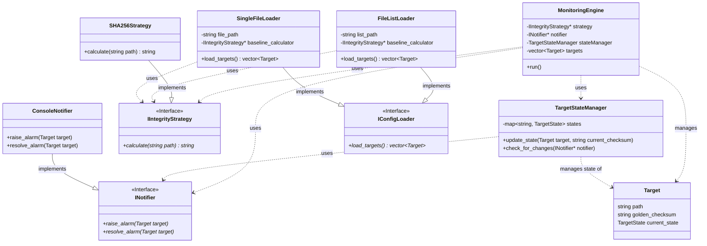

## 개요

파일(GoldenParameter, SystemCriticalFileList)에 대한 변경(수정, 추가 ,삭제)에 대한 활동들을 **monitoring**하여 **Database**에 알람을 적재 및 **SNMP Trap**을 보냅니다.

## 주요 기능
- 파일 간 비교 후 알람 및 SNMP 적재
- 파일의 **Checksum**비교후 알람 및 SNMP 적재

## 기술 스택
**internal**
- Cpp17
- Cmake

**external**
- flatten_json_diff([github](#))
- jbt-log
- nlohmann/json

## 시작 하기
```bash
# build
mkdir -p build && cd build
cmake .. && cmake --build .

# run
./bin/mis_mon
```

---

## 🏛️ 아키텍처 상세 (Architecture)

이 아키텍처는 **DIP(의존성 역전 원칙)**를 핵심으로 합니다. `MonitoringEngine`은 구체적인 `SHA256Strategy`나 `ConsoleNotifier`를 몰라도 됩니다. 단지 `IIntegrityStrategy` 인터페이스의 `calculate()`와 `INotifier`의 `raise_alarm()`을 호출할 뿐입니다.

이는 향후 기능을 확장할 때 매우 유리합니다.

* `MD5Strategy`를 추가하고 싶나요? `IIntegrityStrategy`를 상속받아 구현하고 `main.cpp`에서 주입만 바꾸면 됩니다.
* 알람을 Slack이나 Email로 보내고 싶나요? `INotifier`를 상속받아 `SlackNotifier`를 구현하고 주입만 바꾸면 됩니다. `MonitoringEngine` 코드는 단 한 줄도 수정할 필요가 없습니다. (**OCP - 개방-폐쇄 원칙**)

### 핵심 컴포넌트 UML (Class Diagram)

